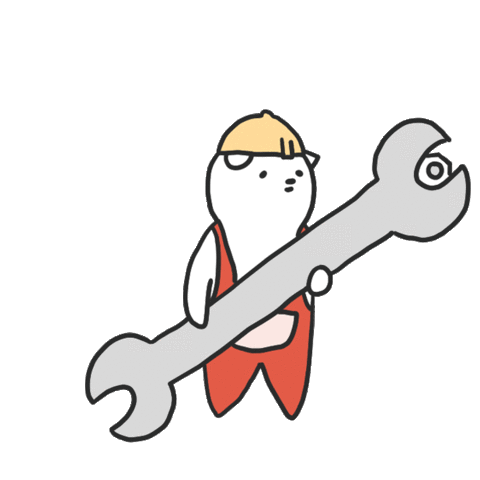

<h1 align="center">Hello everyone!   I'm Marian Slovianyn👋</h1>
<h2 align="center">Frontend Developer</h2>

Hi! My name is Marian, and I am a self-taught frontend developer who loves
experimenting. I enjoy creating engaging and modern projects, constantly improving
my skills, and learning about new technologies. I am eager to find opportunities to
showcase my abilities and am ready for new challenges. As a beginner, I am open to
learning and enhancing my skills to contribute to interesting projects.

 

<h2> Toolkit of a Modern Developer</h2>

  
  
  
  

 

<h2> My Developer Toolkit</h2>

  
  
  
  

 

<h2> Connect with Me</h2>

 
 

   
 

 

 

