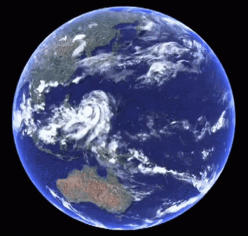

<h1 align="center">Hello everyone!   I'm Marian Slovianyn👋</h1>
<h2 align="center">Frontend Developer</h2>

I am a web development enthusiast with foundational knowledge in HTML, CSS,
JavaScript, and React. My goal is to create intuitive and visually appealing user
interfaces that adhere to modern standards. I continuously improve my skills
through personal projects and courses, and I am committed to achieving a high level
of professionalism in frontend development.

 

<h2> Development Arsenal</h2>

  
  
  
  

 

<h2> Collaborative Development Arsenal</h2>

  
  
  
  

 

<h2> Connect with Me</h2>

 
 

   
 

 

 

